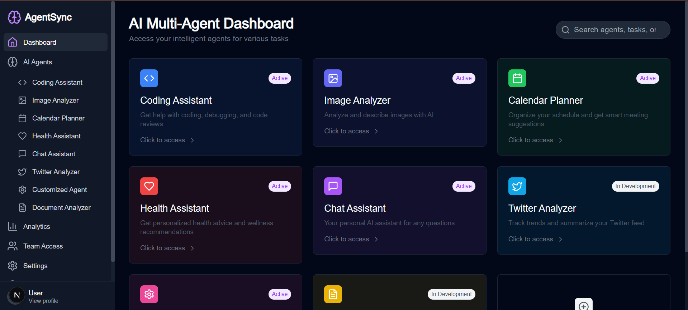
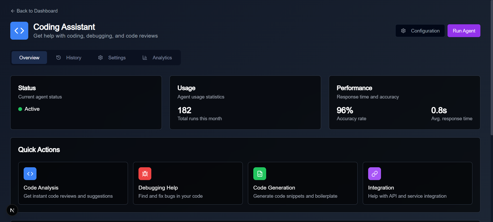
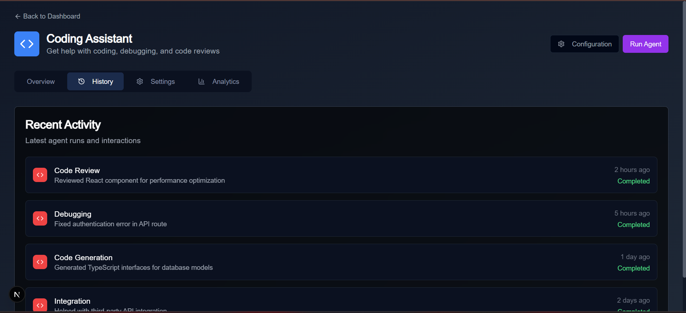

# AgentSync

AgentSync is a modern AI agent management platform that allows users to interact with various specialized AI agents for different tasks. The platform provides a seamless interface for managing, configuring, and interacting with AI agents.

## Features

- **Multiple AI Agents**: Access to various specialized agents including:
  - Email Assistant
  - Calendar Planner
  - Health Assistant
  - Chat Assistant
  - Image Analyzer
  - Twitter Analyzer
  - Customized Agent
  - Document Analyzer

- **User-Friendly Interface**: Modern and intuitive UI with:
  - Dark mode theme
  - Responsive design
  - Easy navigation
  - Real-time chat interface

- **Analytics Dashboard**: Track agent performance and usage statistics

- **Team Collaboration**: Manage team access and permissions

- **Customization**: Configure agent settings and preferences

- **User Profiles**: Personalized user experience with profile management

## Tech Stack

- **Frontend**: Next.js, React, TypeScript
- **UI Components**: Custom UI components with modern design
- **Styling**: Tailwind CSS
- **Icons**: Lucide React
- **State Management**: React Hooks

## Getting Started

### Prerequisites

- Node.js (v14 or higher)
- npm or yarn

### Installation

1. Clone the repository:
```bash
git clone https://github.com/yourusername/AgentSync.git
cd AgentSync
```

2. Install dependencies:
```bash
npm install
# or
yarn install
```

3. Run the development server:
```bash
npm run dev
# or
yarn dev
```

4. Open [http://localhost:3000](http://localhost:3000) in your browser

## Project Structure

```
AgentSync/
├── app/                    # Next.js app directory
│   ├── agent/             # Agent-specific pages
│   ├── analytics/         # Analytics dashboard
│   ├── help/              # Help and support
│   ├── settings/          # User settings
│   └── team/              # Team management
├── components/            # Reusable components
├── public/               # Static assets
└── styles/              # Global styles
```

## Screenshots

### Dashboard


### Agent Interface




### Analytics


### Settings


### User Profile


## Contributing

1. Fork the repository
2. Create your feature branch (`git checkout -b feature/AmazingFeature`)
3. Commit your changes (`git commit -m 'Add some AmazingFeature'`)
4. Push to the branch (`git push origin feature/AmazingFeature`)
5. Open a Pull Request

## License

This project is licensed under the MIT License - see the [LICENSE](LICENSE) file for details.

## Contact

Team Name - [Code-Rangers](https://twitter.com/yourtwitter)

Project Link: [https://github.com/yourusername/AgentSync](https://github.com/rishabharaj/AgentSync) 
